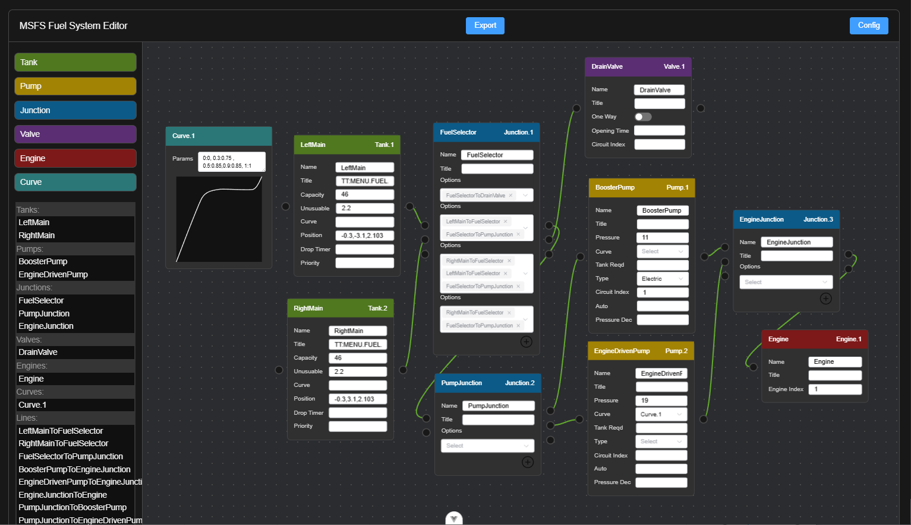

# MSFS Fuel System Editor

Node-based visual editor to create fuel system configuration for MSFS.

Drag new nodes from the sidebar, fill in the details and connect to other nodes.

Your current graph will be saved to your browser's local storage. No data is sent to a server. 

To export the fuel system configuration, click the Export Configuration and copy the contents. You can also export the node graph to import later. 

*Latest Features:* Now lines and nodes can be configured with properties. Lines connecting to Junction nodes can be configured to be one-way or two-way flow.

*Try it out in the browser: [Fuel System Editor](https://sal1800.github.io/MSFS_Fuel_System_Editor/)*




## Development Setup

```sh
npm install
```

### Compile and Hot-Reload for Development

```sh
npm run dev
```

### Compile and Minify for Production

```sh
npm run build
```
